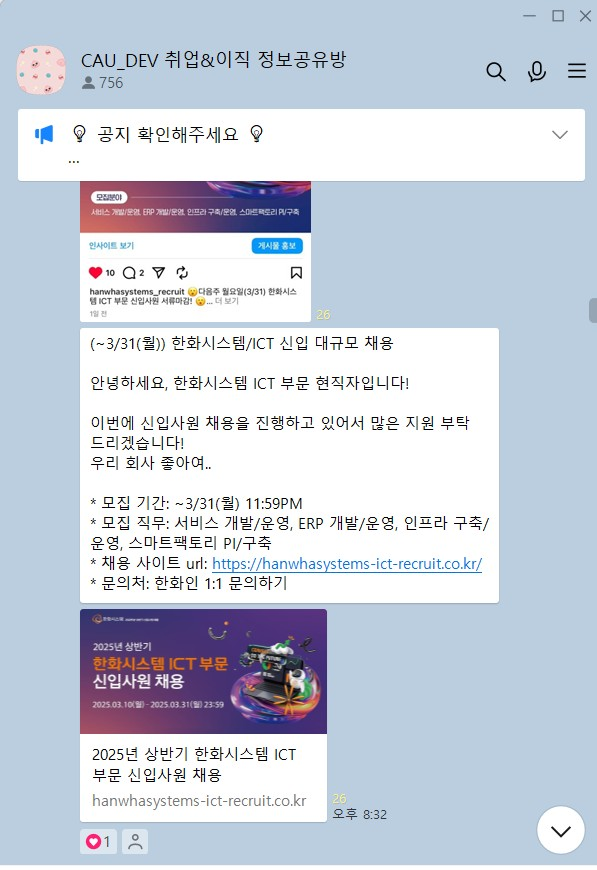
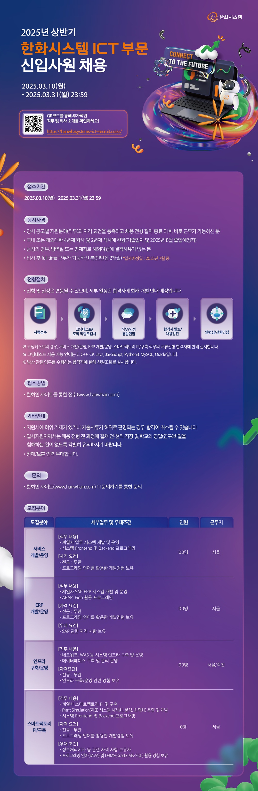
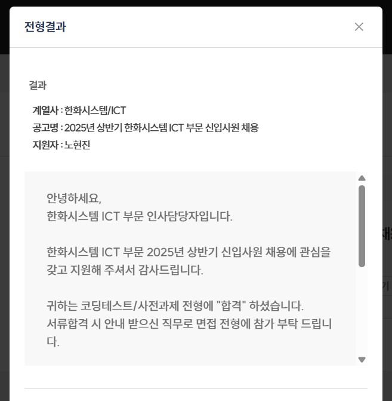
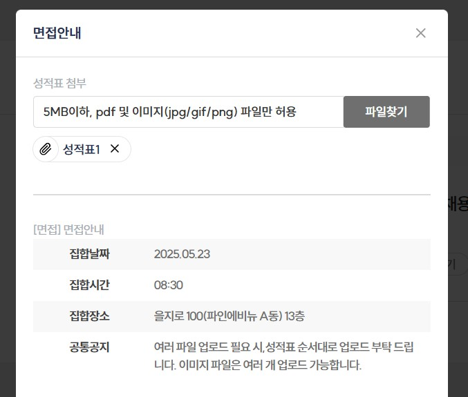
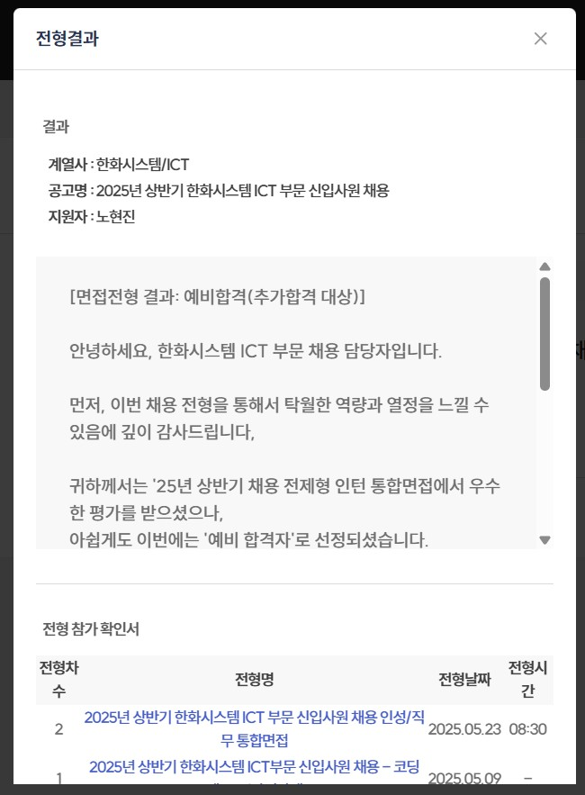
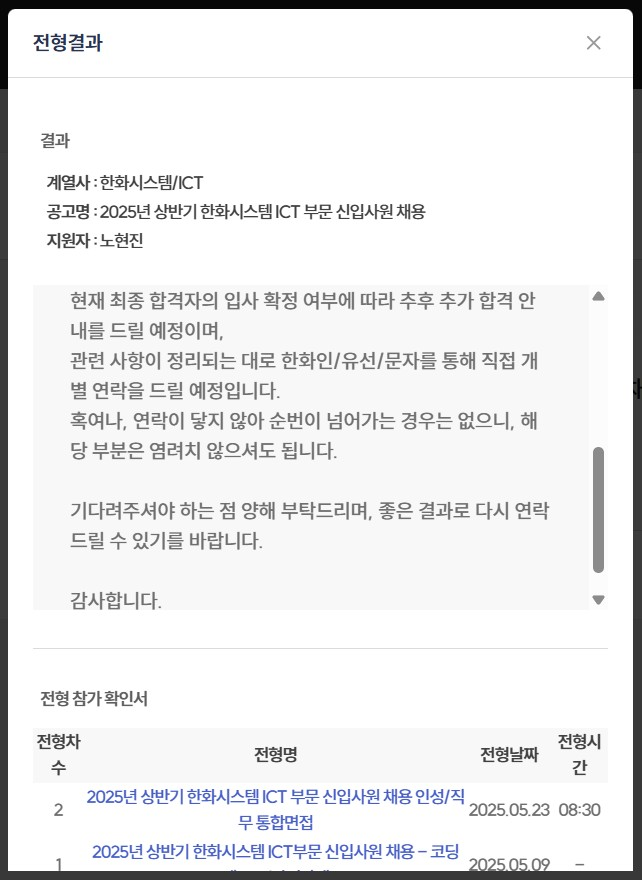
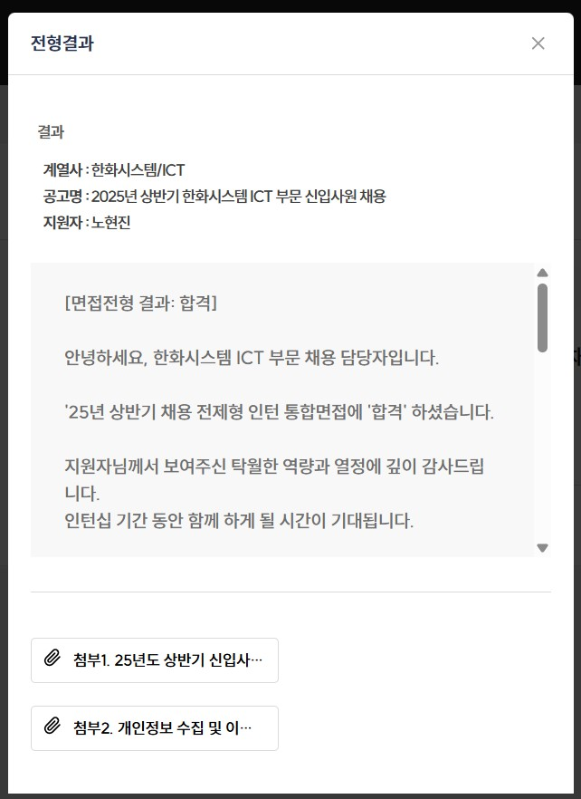
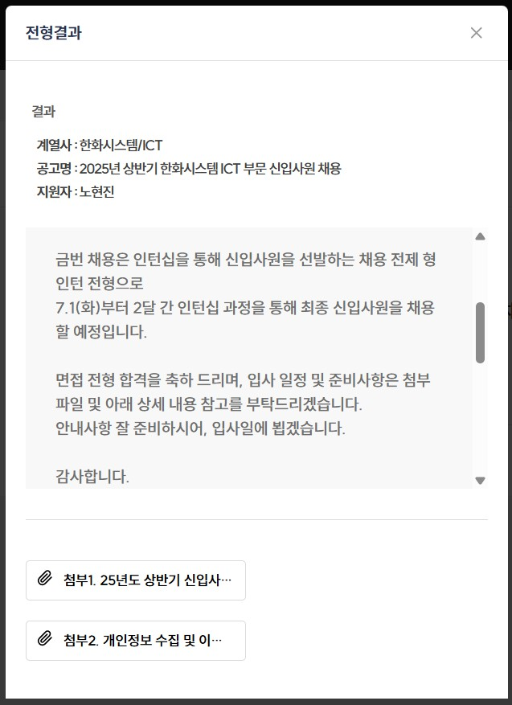
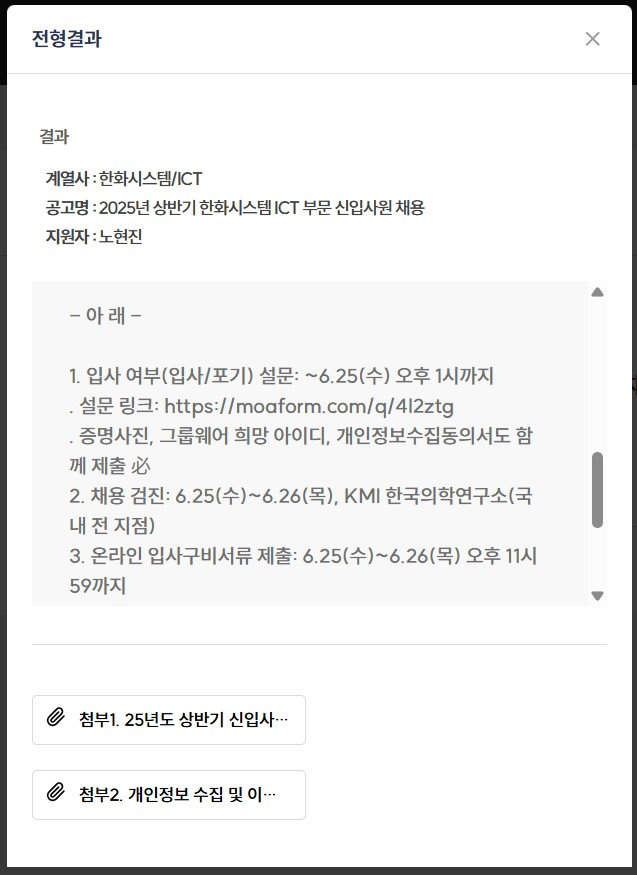
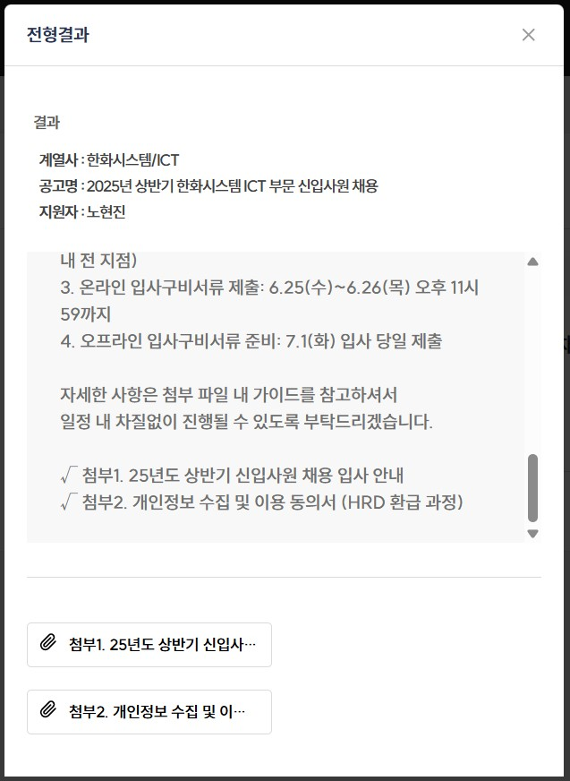

<blockquote class="prompt-info">
<strong><u>Tags</u></strong>  
Recruitment
</blockquote>

## 개요

2025년 상반기 한화시스템 ICT 부문 신입사원 채용 후기를 정리한 페이지입니다.

## 채용 후기

### 채용 공고

네이버 부스트캠프 웹 · 모바일 9기 수료 이후, 올해부터 본격적으로 취업 준비를 하던 중 아래와 같이 2025년 상반기 한화시스템 ICT 부문 신입사원 채용 공고를 보게 되었습니다.

저는 프론트엔드 직무 위주로 역량을 쌓아왔기 때문에, 처음에는 프론트엔드와 백엔드를 구분하지 않는 직무에 지원할지 고민했습니다.

TODO

모집 직무로는 `서비스 운영/개발`, `ERP 개발/운영`, `인프라 구축/운영`, `스마트팩토리 PI/구축`, 이렇게 4가지가 존재했습니다. 서류 작성 시 1지망, 2지망을 선택할 수 있는데, 저는 1지망으로 `서비스 운영/개발`, 2지망으로 `스마트팩토리 PI/구축`을 선택하였습니다.

### 서류 전형

TODO

## 자기 소개서

### 문항 1 (1000자 이내)

한화시스템의 해당 직무에 지원한 이유와 앞으로 한화시스템에서 키워 나갈 커리어 계획을 구체적으로 작성해주시기 바랍니다.

### 문항 2 (1000자 이내)

지원한 직무와 관련하여 본인만의 차별화된 경험과 강점을 가지고 한화시스템에 기여할 수 있는 점을 서술하여 주시기 바랍니다.

### 문항 3 (1000자 이내)

책임감을 가지고 신속하게 행동하여 성과를 냈던 경험에 대해 서술하여 주시기 바랍니다.

### 문항 4 (1000자 이내)

급변하는 환경이나 상황에서 변화에 유연하게 대응하고 그 변화를 기회로 삼아 긍정적인 성과를 이루어낸 경험이 있다면 구체적으로 서술하여 주시기 바랍니다.

### 코딩 테스트 전형

### 면접 전형

## 참고 자료

- <a href="https://hanwhasystems-ict-recruit.co.kr/" target="_blank">2025년 상반기 한화시스템 ICT 부문 신입사원 채용</a>
- <a href="https://www.wanted.co.kr/wd/272300" target="_blank">[한화시스템 ICT 부문] 서비스 개발/운영 채용 공고 | 원티드</a>
- <a href="https://linkareer.com/activity/228060" target="_blank">[한화시스템] ICT 부문 신입사원 채용 | 공모전 대외활동-링커리어</a>
- <a href="https://jasoseol.com/datalab/14089?ec=96993&e=386439" target="_blank">나의 첫 취업플랫폼, 자소설닷컴 | 대기업, 공기업 맞춤 채용</a>
- <a href="https://www.hanwhasystems.com/kr/index.do" target="_blank">한화시스템</a>
- <a href="https://www.jobplanet.co.kr/companies/336387/landing/%ED%95%9C%ED%99%94%EC%8B%9C%EC%8A%A4%ED%85%9C-ict%EB%B6%80%EB%AC%B8" target="_blank">잡플래닛 - Jobplanet</a>
- <a href="https://linkareer.com/cover-letter/search?id=33254&keyword=&organizationName=%ED%95%9C%ED%99%94%EC%8B%9C%EC%8A%A4%ED%85%9C&page=1&role=&sort=PASSED_AT&tab=all" target="_blank">한화시스템 합격자소서 - 링커리어</a>
- <a href="https://thegreatescape.tistory.com/entry/2024%EC%83%81%ED%95%9C%ED%99%94%EC%8B%9C%EC%8A%A4%ED%85%9C-%EA%B0%9C%EB%B0%9C%EC%9E%90-SW%EC%84%9C%EB%B9%84%EC%8A%A4-%EA%B0%9C%EB%B0%9C-%EC%9E%90%EC%86%8C%EC%84%9C-1%EB%B2%88-%EC%A7%80%EC%9B%90%EB%8F%99%EA%B8%B0" target="_blank">[2024상]한화시스템 개발자 SW/서비스 개발 자소서 1번: 지원동기</a>
- <a href="https://blog.naver.com/hellstudy/223811567448?trackingCode=rss" target="_blank">루멘 블로그 Nil Desperandum : 네이버 블로그</a>
- <a href="https://int-main.tistory.com/entry/%ED%95%9C%ED%99%94%EC%8B%9C%EC%8A%A4%ED%85%9C-ICT-%EC%BD%94%ED%85%8C-%ED%9B%84%EA%B8%B0-2023" target="_blank">한화시스템 ICT 코테 후기 2023</a>
- <a href="https://blog.naver.com/grace915/223380297408" target="_blank">한화시스템 취준 후기 (자소서, 코데, AI면접, 면접, 인턴십)</a>
- <a href="https://didu-story.tistory.com/448" target="_blank"><b>[2023 상반기] 한화시스템/ICT 서류, 코딩테스트, 1차, 2차면접 후기</b></a>
- <a href="https://0m1n.tistory.com/152" target="_blank">[한화시스템] 2023년 하반기 한화시스템 ICT 서비스 개발 후기 (서류, AI, 인성, 코딩테스트, 면접)</a>
- <a href="https://velog.io/@charming-l/%EC%9A%B0%EB%8B%B9%ED%83%95%ED%83%95-%ED%95%9C%ED%99%94%EC%8B%9C%EC%8A%A4%ED%85%9C-%EC%84%9C%EB%A5%98%EB%A9%B4%EC%A0%91-%EB%AA%A8%ED%97%98" target="_blank">우당탕탕 한화시스템 서류/면접기</a>
- <a href="https://www.catch.co.kr/News/RecruitNews/296857" target="_blank">한화그룹 상반기 공채 대비 면접후기·기출문제 | 캐치</a>
- <a href="https://jasoseol.com/blog/post/%ED%95%9C%ED%99%94%EC%8B%9C%EC%8A%A4%ED%85%9C-%ED%95%A9%EA%B2%A9-%ED%9B%84%EA%B8%B0-%EC%9E%90%EC%86%8C%EC%84%9C-%ED%8C%81-%EC%9D%B8%EC%A0%81%EC%84%B1-%EB%A9%B4%EC%A0%91-%EC%A7%88%EB%AC%B8%EA%B9%8C/" target="_blank">한화시스템 합격 후기: 자소서 팁, 인적성, 면접 질문까지</a>
- <a href="https://www.jobkorea.co.kr/starter/review/view?C_Idx=386&Half_Year_Type_Code=0&Ctgr_Code=5&FavorCo_Stat=0&G_ID=0&Page=1" target="_blank">한화시스템(주) - 실제 면접 질문 75건 확인하기 | 잡코리아</a>
